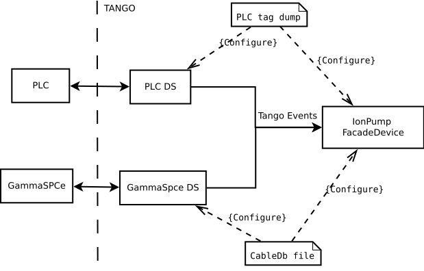

name: empty layout
layout: true

---
name: title
class: center, middle

Title
========================

Author

Date

---
name: Background
layout: true

The problem at hand
=========

---
Several controlsystems (Tango databases)
* Accelerator and storage rings ~ 10 000 devices
* One per beamline ~ 700 devices x 15
* Other systems such as testlabs ~ 500 devices each

Total number of Tango devices at MAX IV > 20 000

Multiple sources of information from the different subsystems that make up a synchrotron:
* Magnets
 * various xls-files
* Vacuum and Diagnostics
 * Allen Bradley PLC tag lists in csv format
 * Cable database 
* Motorization
 * yet another xls file


---

name: Problem
layout: true

Necessity is the mother of invention
=========

---
###We need to:
* Keep our configuration consistent and correct
* Keep up with demands for updates and changes
* Keep track of changes

###How do we do it?
* Ensure consistency of source files
 * MAXIV naming convention is common ground
 * Track versions
* Conversion tools for each type of source file
* Intermediate format that can be used by a
* Simple deployment tool that also allows us to
* Track our configuration

---

name:
layout: true


A comfortable situation?
=========

---
The current state
----
* Source files are delivered to us with versioning through Alfresco
* Beamline installation process is well defined
* Updates are applied in a safe and predictable manner 

Plans
----
* Web interface to allow subsystem owners to check their source files
* Add conversion tools for even more subsystems
* Allow some subsystems owners to apply their own updates 
 
---
name: Dsconfig 
layout: true

The Json format
=========

---

Close to the jive server view:

```json
    "servers": {
        "some-server/instance": {
            "SomeDeviceClass": {
                "some/device/1": {
                    "properties": {
                        "someImportantProperty": [
                            "foo",
                            "bar"
                        ],
                        "otherProperty": ["7"]
                    },
                    "attribute_properties": {
                        "anAttribute": {
                            "min_value": ["-5"],
                            "unit": ["mV"]
                        }
                    }
                }
            }
        }
    },
```
---

name: Dsconfig 
layout: true

Deployment
=========

---


```bash
 antdup@w-v-kitslab-cc-0: json2tango someconfig.json 
+ Device: some/device/1
  Server: some-server/instance
  Class: SomeDeviceClass
  Properties:
    + otherProperty
      7
    + someImportantProperty
      foo
      bar
  Attribute properties:
    anAttribute
      + unit
        mV


Summary:
Add 1 servers.
Add 1 devices to 1 servers.
Add/change 2 device properties in 1 devices.
Add/change 2 device attribute properties in 1 devices.


```
---

name: Dsconfig 
layout: true

Renaming
=======

---

```bash
- Device: some/device/1
  Server: some-server/instance
  Class: SomeDeviceClass

+ Device: some/device/2
  Server: some-server/instance
  Class: SomeDeviceClass
  Properties:
    + otherProperty
      7
    + someImportantProperty
      foo
      bar
  Attribute properties:
    anAttribute
      + unit
        mV


Summary:
Add 1 devices to 1 servers.
Delete 1 devices.
Add/change 2 device properties in 1 devices.
Add/change 2 device attribute properties in 1 devices.
```
---

name: Dsconfig 
layout: true

Editing
=========

---


```bash
= Device: some/device/1
  Properties:
    + extraProperty
      89
    = otherProperty
      - 7
      + 8


Summary:
Add/change 2 device properties in 1 devices.


```

---
name: Getting to the Json
layout: true

Getting to the Json - worst and best case
=========

---

Magnet Configuration
-----
The magnet properties are converted to the json file format by a script that takes a total of four input sources: 
1. A lattice file that contains all the magnets in the Linac, their type and length 
2. A magnet to power supply mapping file (xls)
3. The xls sheet of calibration data  
4. A sheet of alarm interlock tags from the PLC 


---
name: Getting to the Json
layout: true


PLC-controlled Devices
=====

---

Facade-devices based on groups of PLC-tags are generated from jinja-templates with a script that takes a CSV-file dumped directly from the PLC program as input. All tag names follow the MAXIV naming convention.


---


Thermocouple HLDevice:
---------

```ipython
ITango [4]: Thermocouple("r3-301m1/dia/tco-02").get_attribute_list()
Result [4]: 
['ByPassed',
'HighWarning',
'HighAlarm',
'LowWarning',
'Temperature',
'LowAlarm',
'State',
'Status ']
```

PLC tag format:

```csv
AI_R3_301M1_DIA_TCO02_U     #T Chamber thermocouple value
B_R3_301M1_DIA_TCO02_BYP_C  #T Bypass Alarm Signal commando
FB_R3_301M1_DIA_TCO02_AA    #T Thermocouple Chamber temperature alarm
```


---

```json

"servers": {
  "Thermocouple/R3-301": {
    "Thermocouple": {
      "R3-301M1/DIA/TCO-02": {
        "properties": {
          "ByPassedAttribute": [
              "R3-301/VAC/PLC-01/B_R3_301M1_DIA_TCO02_BYP_C"],
          "Coefficient": ["0.1"],
          "HighAlarmAttribute": [
              "R3-301/VAC/PLC-01/FB_R3_301M1_DIA_TCO02_AA__HHInAlarm"],
          "HighWarningAttribute": [
              "R3-301/VAC/PLC-01/FB_R3_301M1_DIA_TCO02_AA__HInAlarm"],
          "LowAlarmAttribute": [
              "R3-301/VAC/PLC-01/FB_R3_301M1_DIA_TCO02_AA__LLInAlarm"],
          "LowWarningAttribute": [
              "R3-301/VAC/PLC-01/FB_R3_301M1_DIA_TCO02_AA__LInAlarm"],
          "TemperatureAttribute": [
              "R3-301/VAC/PLC-01/AI_R3_301M1_DIA_TCO02_U"]
                
```

---
 
PyAlarm devices generated
----------


```json
PyAlarm/R3-301-VAC": {
  "PyAlarm": {
    "R3-301/VAC/ALARM-01": {
      "properties": {
        "AlarmDescriptions": [
          "FB_R3_301M1_DIA_TCO02_AA__HHInAlarm:Thermocouple Chamber temperature alarm",
          "FB_R3_301M1_DIA_TCO02_AA__HInAlarm:Thermocouple Chamber temperature alarm",
          "FB_R3_301M1_DIA_TCO02_AA__LInAlarm:Thermocouple Chamber temperature alarm",
          "FB_R3_301M1_DIA_TCO02_AA__LLInAlarm:Thermocouple Chamber temperature alarm",
        ],
        "AlarmList": [
          "FB_R3_301M1_DIA_TCO02_AA__HHInAlarm:R3-301/VAC/PLC-01/FB_R3_301M1_DIA_TCO02_AA__HHInAlarm.quality == ATTR_VALID and R3-301/VAC/PLC-01/FB_R3_301M1_DIA_TCO02_AA__HHInAlarm",
          "FB_R3_301M1_DIA_TCO02_AA__HInAlarm:R3-301/VAC/PLC-01/FB_R3_301M1_DIA_TCO02_AA__HInAlarm.quality == ATTR_VALID and R3-301/VAC/PLC-01/FB_R3_301M1_DIA_TCO02_AA__HInAlarm",
          "FB_R3_301M1_DIA_TCO02_AA__LInAlarm:R3-301/VAC/PLC-01/FB_R3_301M1_DIA_TCO02_AA__LInAlarm.quality == ATTR_VALID and R3-301/VAC/PLC-01/FB_R3_301M1_DIA_TCO02_AA__LInAlarm",
          "FB_R3_301M1_DIA_TCO02_AA__LLInAlarm:R3-301/VAC/PLC-01/FB_R3_301M1_DIA_TCO02_AA__LLInAlarm.quality == ATTR_VALID and R3-301/VAC/PLC-01/FB_R3_301M1_DIA_TCO02_AA__LLInAlarm",
        ],


```
---

cable db

```
Equip. A                       |   Equip. B
R3-A111611-CAB02-VAC-IPCUA-01  |   R3-316L-VAC-IPFC-01
```

---


.center[]


---

User autonomie 
------------

- Json file can be generated automaticaly from gitlab runner.
- Source files are downloaded from Alfresco.
- One config file is generated per tango devices.
- Static error checking.
- Json2tango display changes.

--- 


```bash
-rw-r--r-- 1 antdup antdup 896K Jun  1 11:34 config-eip.json
-rw-r--r-- 1 antdup antdup  35K Jun  1 11:34 config-fge.json
-rw-r--r-- 1 antdup antdup  943 Jun  1 11:34 config-frontend.json
-rw-r--r-- 1 antdup antdup  26K Jun  1 11:34 config-fsw.json
-rw-r--r-- 1 antdup antdup  13K Jun  1 11:34 config-ha.json
-rw-r--r-- 1 antdup antdup  769 Jun  1 11:34 config-hlplc.json
-rw-r--r-- 1 antdup antdup  27K Jun  1 11:34 config-ip.json
-rw-r--r-- 1 antdup antdup 766K Jun  1 11:34 config-pyalarm.json
-rw-r--r-- 1 antdup antdup 4.2K Jun  1 11:34 config-stepperdriver5p.json
-rw-r--r-- 1 antdup antdup 583K Jun  1 11:34 config-tco.json
-rw-r--r-- 1 antdup antdup  50K Jun  1 11:34 config-tse.json
-rw-r--r-- 1 antdup antdup  35K Jun  1 11:34 config-valve.json
-rw-r--r-- 1 antdup antdup  29K Jun  1 11:34 config-vgc.json
```


---
Error handling 
```
Process config-fsw.json : 
 No missing tag 
========================================
Process config-ha.json : 
 Missing tag HeatAbsorber/B308A, HeatAbsorber, B308A-FE/VAC/HA-01, StatusOpenAttribute
 Missing tag HeatAbsorber/B308A, HeatAbsorber, B308A-FE/VAC/HA-01, StatusClosedAttribute
 Missing tag HeatAbsorber/B308A, HeatAbsorber, B308A-FE/VAC/HA-01, ErrorAttribute
 Missing tag HeatAbsorber/B308A, HeatAbsorber, B308A-FE/VAC/HA-01, CloseAttribute
 Missing tag HeatAbsorber/B308A, HeatAbsorber, B308A-FE/VAC/HA-01, OpenAttribute
 Missing tag HeatAbsorber/B308A, HeatAbsorber, B308A-FE/VAC/HA-01, ByPassedAttribute
 Missing tag HeatAbsorber/B303A, HeatAbsorber, B303A-FE/VAC/HA-01, StatusOpenAttribute
 Missing tag HeatAbsorber/B303A, HeatAbsorber, B303A-FE/VAC/HA-01, StatusClosedAttribute
 Missing tag HeatAbsorber/B303A, HeatAbsorber, B303A-FE/VAC/HA-01, ErrorAttribute
 Missing tag HeatAbsorber/B303A, HeatAbsorber, B303A-FE/VAC/HA-01, CloseAttribute
 Missing tag HeatAbsorber/B303A, HeatAbsorber, B303A-FE/VAC/HA-01, OpenAttribute
 Missing tag HeatAbsorber/B303A, HeatAbsorber, B303A-FE/VAC/HA-01, ByPassedAttribute
```


---
name: Sardana devices
layout: true


Sardana Devices
=====

Hardware group maintain an xls file with all motors and configuration (names, type, step per units, ... ) 

Json2tango has been adapted to Sardana (generate ids, ctrl_ids and sardana specific properties))

Can display a diff between the configuration file and the actual configuration

Compatible with existing file (use dump)

---
name: HDB++ configuration
layout: true


HDB++ configuration
=====


List of the expected configuration based on device class

Knows which device are pushing archive events

Can easly display missing attribute in the archiving system or miss configuration

Display a diff before execution

Can configure polling and events (throught the hdbpp_event_manager)


